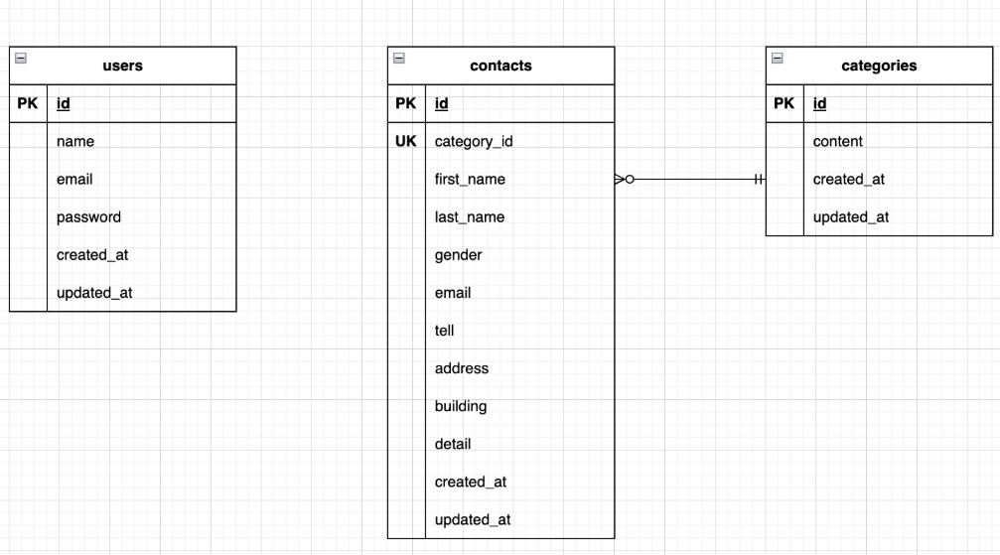

# FashionablyLate（お問い合わせフォーム）

Laravel を使用したお問い合わせフォームおよび管理画面を備えた Web アプリケーションです。

---

## 環境構築

### Docker ビルド

1. リポジトリをクローン

```bash
git clone git@github.com:yutaka-fujise/practice1.git
```

2. DockerDesktop アプリを立ち上げる 3.コンテナをビルド・起動

```bash
docker-compose up -d --build
```

> _Mac の M1・M2 チップの PC の場合、`no matching manifest for linux/arm64/v8 in the manifest list entries`のメッセージが表示されビルドができないことがあります。
> エラーが発生する場合は、docker-compose.yml ファイルの「mysql」内に「platform」の項目を追加で記載してください_

```yaml
mysql:
    platform: linux/x86_64
    image: mysql:8.0.26
    environment:
```

**Laravel 環境構築**
1.PHP コンテナへログイン

```bash
    docker-compose exec php bash
```

2.パッケージをインストール

```bash
     composer install
```

3.環境ファイル作成
「.env.example」ファイルを 「.env」ファイルに命名を変更。または、新しく.env ファイルを作成 4. .env に以下の環境変数を追加

```text
DB_CONNECTION=mysql
DB_HOST=mysql
DB_PORT=3306
DB_DATABASE=laravel_db
DB_USERNAME=laravel_user
DB_PASSWORD=laravel_pass
```

5. アプリケーションキーの作成

```bash
php artisan key:generate
```

6. マイグレーションの実行

```bash
php artisan migrate
```

7. シーディングの実行

```bash
php artisan db:seed
```

## 主な機能

・ユーザー側機能
・お問い合わせフォーム入力
・入力内容確認画面表示
・バリデーションチェック
・送信完了（サンクスページ表示）
・入力内容の修正機能

## 管理画面機能

・会員登録・ログイン機能（Fortify）
・お問い合わせ一覧表示
・条件検索（名前・性別・日付）
・ページネーション表示
・モーダルによる詳細表示
・お問い合わせ削除機能

管理画面の利用方法
・会員登録
http://localhost/register
・ログイン
http://localhost/login
・管理画面
http://localhost/admin

## 使用技術(実行環境)

-   PHP8.3.0
-   Laravel8.83.27
-   MySQL8.0.26

## ER 図



## URL

・お問い合わせフォーム：http://localhost/
・管理画面：http://localhost/admin
・phpMyAdmin：http://localhost:8080/
